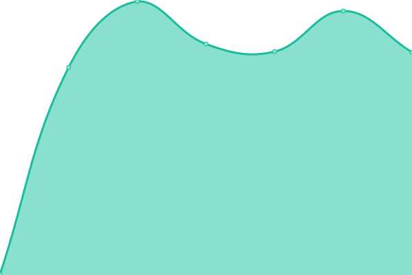
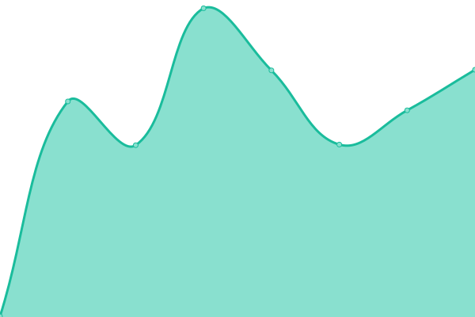
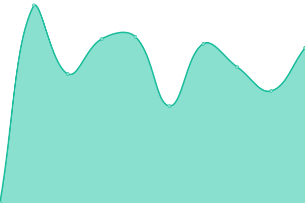

# [📈 Live Status](https://yamagami2211.github.io): <!--live status--> **🟩 すべてのシステムは正常に稼働**

このリポジトリは[Upptime](https://github.com/upptime/upptime)を利用した、オープンソースの死活監視(稼働時間モニターとステータスページ)です。
ステータスページは https://status.yama2211.jp/ です。

<!--start: status pages-->
<!-- This summary is generated by Upptime (https://github.com/upptime/upptime) -->
<!-- Do not edit this manually, your changes will be overwritten -->
<!-- prettier-ignore -->
| URL | 状態 | 履歴 | 応答時間 | 稼働時間 |
| --- | ------ | ------- | ------------- | ------ |
|  [SV1](http://sv01-vps.yama2211.jp) | 🟩 正常 | [sv-1.yml](https://github.com/yamagami2211/site-kanshi/commits/HEAD/history/sv-1.yml) | 

 405ミリ秒
     
 | 

<a href="https://status.yama2211.jp/history/sv-1">98.97%</a>
    

|  [SV2](http://sv02-vps.yama2211.jp) | 🟩 正常 | [sv-2.yml](https://github.com/yamagami2211/site-kanshi/commits/HEAD/history/sv-2.yml) | 

 385ミリ秒
     
 | 

<a href="https://status.yama2211.jp/history/sv-2">100.00%</a>
    

|  [SV3](http://sv03-vps.yama2211.jp) | 🟩 正常 | [sv-3.yml](https://github.com/yamagami2211/site-kanshi/commits/HEAD/history/sv-3.yml) | 

 355ミリ秒
     
 | 

<a href="https://status.yama2211.jp/history/sv-3">98.97%</a>
    

|  Redmine | 🟩 正常 | [redmine.yml](https://github.com/yamagami2211/site-kanshi/commits/HEAD/history/redmine.yml) | 

 340ミリ秒
     
 | 

<a href="https://status.yama2211.jp/history/redmine">100.00%</a>
    

<!--end: status pages-->

[**Visit our status website →**](https://status.yama2211.jp/)

## 📄 License

- Powered by: [Upptime](https://github.com/upptime/upptime)
- Code: [MIT](./LICENSE) © [yamagami2211](https://yama2211.biz)
- Data in the `./history` directory: [Open Database License](https://opendatacommons.org/licenses/odbl/1-0/)
