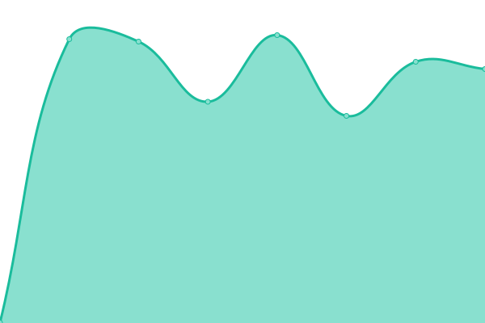

# [📈 Live Status](https://yamagami2211.github.io): <!--live status--> **🟥 完全な停止**

このリポジトリは[Upptime](https://github.com/upptime/upptime)を利用した、オープンソースの死活監視(稼働時間モニターとステータスページ)です。
ステータスページは https://status.yama2211.jp/ です。

<!--start: status pages-->
<!-- This summary is generated by Upptime (https://github.com/upptime/upptime) -->
<!-- Do not edit this manually, your changes will be overwritten -->
<!-- prettier-ignore -->
| URL | 状態 | 履歴 | 応答時間 | 稼働時間 |
| --- | ------ | ------- | ------------- | ------ |
|  V3 | 🟥 停止 | [v3.yml](https://github.com/yamagami2211/site-kanshi/commits/HEAD/history/v3.yml) | 

 0ミリ秒
     
 | 

<a href="https://status.yama2211.jp/history/v3">0.00%</a>
    

<!--end: status pages-->

[**Visit our status website →**](https://status.yama2211.jp/)

## 📄 License

- Powered by: [Upptime](https://github.com/upptime/upptime)
- Code: [MIT](./LICENSE) © [yamagami2211](https://yama2211.jp)
- Data in the `./history` directory: [Open Database License](https://opendatacommons.org/licenses/odbl/1-0/)
